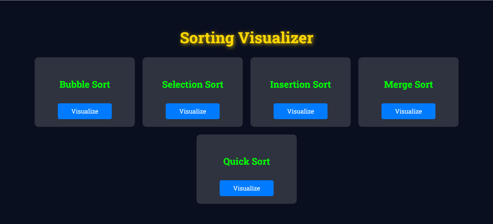
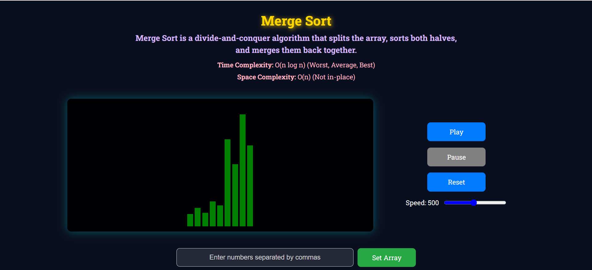

# 🔢 AlgoMorph – Sorting Algorithm Visualizer

AlgoMorph is an interactive web-based application that helps users understand how different sorting algorithms work through step-by-step visual animations.

Users can enter their own array values, control animation speed, and visualize sorting in real-time.

---

## 🚀 Features

- Visualize multiple sorting algorithms
- User-defined input array
- Play, Pause, Reset controls
- Adjustable speed slider
- Clean and responsive UI
- Algorithm description & complexity display

---

## 📊 Algorithms Implemented

- Bubble Sort  
- Selection Sort  
- Insertion Sort  
- Merge Sort  
- Quick Sort  

---

## 🖼 Screenshots

### Home Page

### Merge Sort Visualization

---

## 🛠 Tech Stack

- HTML  
- CSS  
- JavaScript  

---

## 📂 Project Structure

